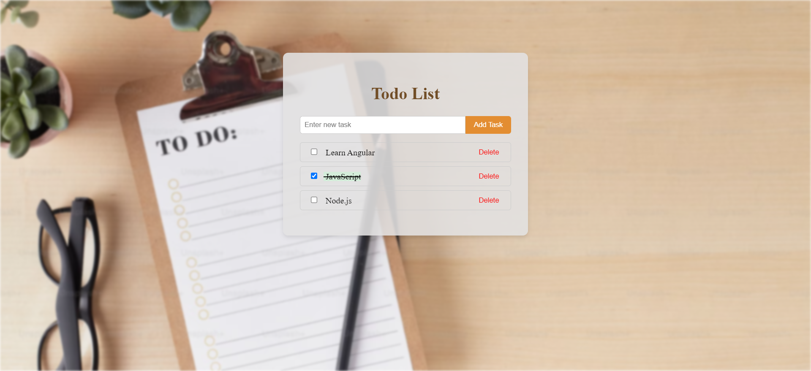

<div id="top"></div>

</br>
<div align="center">
      <a href="https://todo-list-eight-ebon.vercel.app/">
       
      </a>
</div>

### Built With

- Angular
- TypeScript
- Angular CLI
- JSON Server (for local mock API)

### Features

- **Add Tasks**: Users can add new tasks to the list.
- **Remove Tasks**: Users can remove tasks from the list.
- **Mark as Completed**: Users can mark tasks as completed or incomplete.
- **Persistent State**: Tasks are stored and retrieved from a local and a deployed JSON Server.
- **Responsive UI**: Modern and clean interface, ensuring good user experience on different devices.
- **Real-Time Updates**: Task list updates instantly as users interact with it.
- **Error and Loading States**: Handle loading and error messages for all crud operations.

<p align="right">(<a href="#top">back to top</a>)</p>

---

## Getting Started

This project require some perquisites and dependencies to be installed, you can find the instructions below:

### Installation

> To get a local copy, follow these simple steps :

1. Clone the repo

   ```sh
   git clone https://github.com/SayedShehata1/Angular-TODO-LIST
   ```

2. go to client folder

   ```sh
   cd Angular-TODO-LIST
   ```

3. install dependencies

   ```bash
   npm install
   ```

4. Run the local JSON server

   ```sh
   npm run json-server
   ```

5. Run development server

   ```sh
   npm run dev
   ```

<p align="right">(<a href="#top">back to top</a>)</p>
